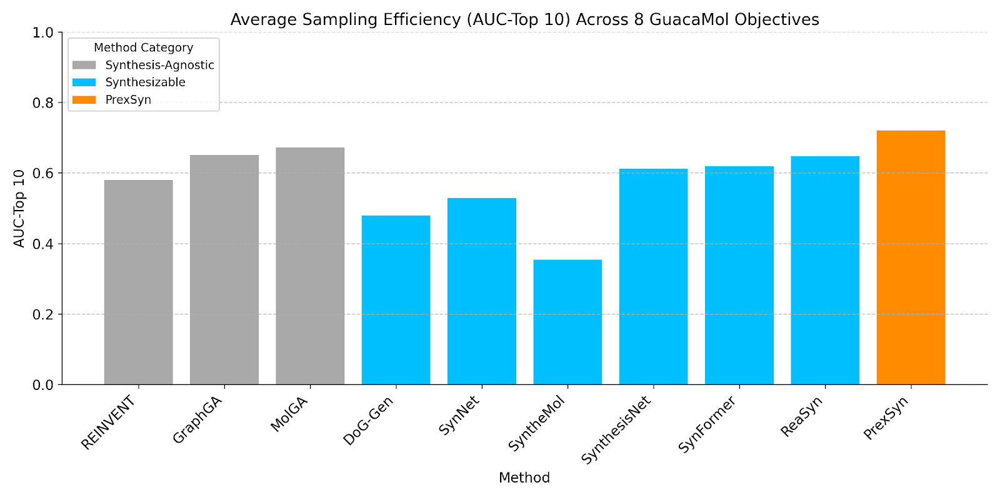

# PrexSyn


## Introduction

PrexSyn is an efficient, accurate, and programmable framework for synthesizable molecular design.
It is based on a decoder-only transformer architecture that autoregressively generates *postfix notations of
synthesis*[^chemprojector] (a molecular representation based on chemical reactions and purchasable building blocks) conditioned on molecular properties.

[^chemprojector]: Projecting Molecules into Synthesizable Chemical Spaces. [https://arxiv.org/abs/2406.04628](https://arxiv.org/abs/2406.04628)

PrexSyn is trained on a billion-scale datastream of postfix notations paired with molecular properties using only two GPUs and 32 CPU cores in two days. This is made possible by [PrexSyn Engine](https://github.com/luost26/prexsyn-engine), a real-time, high-throughput C++-based data generation pipeline.


/// caption
PrexSyn framework overview from the [paper](https://arxiv.org/abs/2512.00384).
///


## Capabilities

### Chemical Space Projection

Chemical space projection[^chemprojector] refers to finding synthesizable molecules similar to a given target molecule in the predefined chemical space.

{: width="300" }
/// caption
///

PrexSyn can project molecules into synthesizable chemical spaces much more efficiently and accurately than prior methods.

{: width="500" }
/// caption
///

We provide a quick demo of chemical space projection. You can find the instructions [here](getting-started/examples.md).

### Molecular Sampling

Given an oracle function (e.g. docking score, predicted bioactivity, etc.), PrexSyn can sample synthesizable molecules to maximize the oracle score. It starts with a random set of molecules and iteratively refines the property query to generate better molecules.

{: width="350" }
/// caption
///

PrexSyn achieves higher sampling efficiency on the GuacaMol molecular optimization benchmark even compared to synthesis-agnostic baselines.



You can find a quick demo of molecular sampling [here](getting-started/examples.md).


## Resources

### Repositories

- **PrexSyn**: [https://github.com/luost26/prexsyn](https://github.com/luost26/prexsyn)
- **PrexSyn Engine**: The C++ backend that provides a high-throughput training data pipeline and a fast synthesis detokenizer. [https://github.com/luost26/prexsyn-engine](https://github.com/luost26/prexsyn-engine)
- **Data and Weights**: Preprocessed chemical space data and trained model weights hosted on Hugging Face. [https://huggingface.co/datasets/luost26/prexsyn-data/tree/main](https://huggingface.co/datasets/luost26/prexsyn-data/tree/main)

### Papers and Documentation

- **PrexSyn Paper**: Efficient and Programmable Exploration of Synthesizable Chemical Space. [https://arxiv.org/abs/2512.00384](https://arxiv.org/abs/2512.00384)
- **PrexSyn Documentation**: [https://prexsyn.readthedocs.io](https://prexsyn.readthedocs.io)

### Miscellaneous

- **MIT Coley Research Group**: [https://coley.mit.edu/](https://coley.mit.edu/)

## Citation

```bibtex
@article{luo2025prexsyn,
  title   = {Efficient and Programmable Exploration of Synthesizable Chemical Space},
  author  = {Shitong Luo and Connor W. Coley},
  year    = {2025},
  journal = {arXiv preprint arXiv: 2512.00384}
}
```
